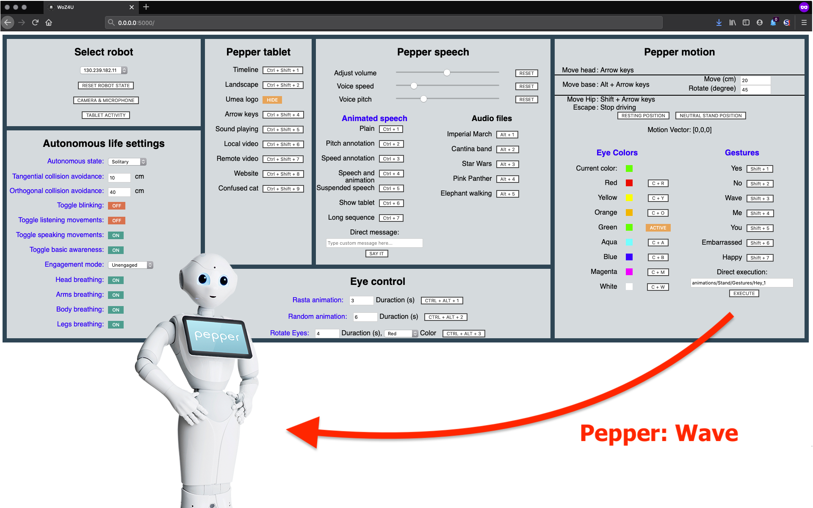
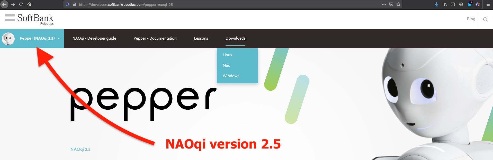
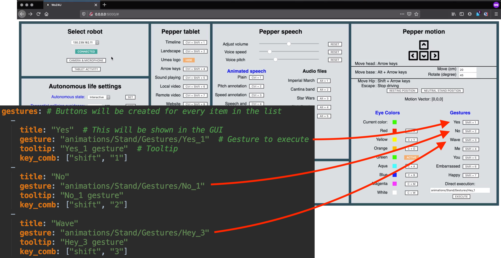

# Table of Contents:
+ [WoZ4U - What is this?](#woz4u---what-is-this)
+ [Installation](#installation)
    + [Download WoZ4U](#download-woz4u)
    + [Download NAOqi 2.5](#download-naoqi-api)
    + [Setting up the environment](#setting-up-the-environment)
    + [Running WoZ4U](#running-woz4u)
+ [Configuring WoZ4U](#configuring-woz4u)
    + [A word on YAML syntax](#a-word-on-yaml-syntax)
    + [Connecting WoZ4U to your Pepper](#connecting-woz4u-to-your-pepper)
    + [Configuring Pepper's default state](#configuring-peppers-default-state)
    + [Adding tablet items](#adding-tablet-items)
    + [Adding text message](#adding-text-message)
    + [Adding audio files](#adding-audio-files)
    + [Adding LED colors](#adding-led-colors)
    + [Adding gesture animations](#adding-gesture-animations)
+ [Citation]()

# WoZ4U - What is this?
In this repository, we host WoZ4U, a fully configurable interface for Softbank's Pepper robot. Our main objective is 
to provide an easy to use yet flexible and powerful tool for the conduction of Wizard-of-Oz experiment with Pepper, 
which are an essential method for general HRI research. 
Further, we hope to make Pepper as a research platform more accessible for 
non-technical groups (social sciences), by providing means to conduct Wizard-of-Oz experiments on Pepper without needing 
expert programming knowledge.



# Installation
WoZ4U is implemented as a Flask HTTP server and is accessed via browser, nevertheless,  a few steps are required to run WoZ4U on your machine. Firstly, WoZ4U requires the **NAOqi API v2.5**, which is only available for licensed Pepper owners and only supports **Python 2.7**. Hence, we recommend to set up a dedicated Python 2.7 virtual environment and 
install all requirements there:

### Download WoZ4U
For now, just clone this Github Repo to your local machine: `git clone https://github.com/frietz58/WoZ4U.git`
Change working directory inside the repo folder: `cd WoZ4U`

### Download NAOqi API
1. Download the NAOqi API from Softbank's website:

From the download page, select the SDK (not Choregraphe), and download the archive. Extract the archive to an arbitrary
location. 
2. To send requests from WoZ4U's browser interface to the NAOqi API (and ultimately onto the physical Pepper), 
WoZ4U needs to know where to find the API on your machine. We do this via the script `set_paths.sh`:
    1. Edit the first line in `set_paths.sh` by replacing everything after the colon with the path to the `site-packages` 
    folder inside the extracted NAOqi folder:
    ```bash
    # export PYTHONPATH=${PYTHONPATH}:/ABSOLUTE/PATH/TO/SITE-PACKAGES/FOLDER/IN/NAOQI-API-FOLDER
    export PYTHONPATH=${PYTHONPATH}:/Users/finn/Desktop/WTM/pepper_scripts/pynaoqi-python2.7-2.5.7.1-mac64/lib/python2.7/site-packages
    ``` 
    2. Edit the second line in `set_paths.sh` by replacing everything after the colon with the path to the 
    `lib` folder inside the extracted NAOqi folder:
    ```bash
    # export PYTHONPATH=${PYTHONPATH}:/ABSOLUTE/PATH/TO/LIB/FOLDER/IN/NAOQI-API-FOLDER
    export PYTHONPATH=${PYTHONPATH}:/Users/finn/Desktop/WTM/pepper_scripts/pynaoqi-python2.7-2.5.7.1-mac64/lib
    ```
In order to be able to execute the script, make it executable: `chmod +x set_paths.sh`

Now, every time you want to use WoZ4U (in a new terminal session), first `source` the `set_paths.sh` script in the same session. Doing that adds the requires libraries to your `PATH`, so that they can be found by Python later. See section 
[Running WoZ4U](#running-woz4u) for a concrete example. Obviously, you can adjust your `.bashrc` accordingly, the familiar won't need additional instructions ;)


### Setting up the environment
1. Install Python 2.7, if you don't have it, from here: https://www.python.org/downloads/ . Verify installation by running `python2.7 --version`, which should output `Python 2.7.16` if you have Python 2.7 installed.
2. Install Python's virtualenv package: `pip install virtualenv`
3. Make a fresh Python 2.7 virtual environment: `virtualenv -p /usr/bin/python2.7 woz4u_venv`. Pay attention to providing the correct Python (**2.7**) interpreter by setting the correct path to the `-p /path/to/interpreter` argument.
4. Activate the environment: `source woz4u_venv/bin/activate`. In your terminal, the prompt should now be prefixed with
`(woz4u_venv)`, indicating that the environment is active and that requirements will be installed in that environment.
5. Install WoZ4U's requirements from the `requirements.txt` file in the virtual environment: 
`pip install -r requirements.txt`. Here, I assume that your current working directory is still set to the main repository folder: `WoZ4U`. If you changed working directories in the meantime, provide the path to the `requirements.txt` file to the `-r` argument of the `pip install` call.

### Running WoZ4U
For the main command to work, those conditions must be met:
1. Paths to the NAOqi API are set in `set_paths.sh`
2. Virtual environment is active in the current terminal session (activate with `source woz4u_venv/bin/active`).
3. Requirements are installed in the environment.
4. Terminals working directory is set to inside the repositories folder (`cd WoZ4U`) 

Run the WoZ4U Flask server with the following command: 
```bash
source set_paths.sh && python server.py
```

This executes the script `set_path.sh`, which makes the NAOqi API available to Python, then `python server.py` runs the flask server that hosts the WoZ4U interface. The server will run until you either close the terminal session or kill the process by pressing `CTRL + C`.

While the server is running, you can assess the interface via your browser of choice (developed with Firefox), via the 
URL `http://0.0.0.0:5000`.

# Configuring WoZ4U
In order to use WoZ4U with you own Pepper robot and configuring the context and experiment specific items, you only have to edit one central YAML file, that holds the concrete values for all the UI elements in the frontend. As a general rule for working with WoZ4U, only edit, add, or delete ***values***, but never edit ***keys***! When the `config.yaml` file is parsed by the server, the keys in the file (eg names of fields, list, or object) are the only thing that bridges
the backend with the frontend. For example, buttons for text messages are generated because the list named `animated_speech` in the `config.yaml` file is sent to the frontend (hence changing the name of that list will break the system). 
As a guideline in laymen's terms: You are fine to edit whatever is to the right of a colon, but now that is to the left! The general idea behind the configuration file is
illustrated here:

For most sections of the interface, you populate a YAML list with the concrete items (text messages, images, gestures, etc)
that are relevant for your use-case. For each element in the list corresponding to each section, UI elements will be
created in the WoZ4U frontend. Hence, via this configuration file, the interface can be fully configured to any specific
use-case.

### A word on YAML syntax
YAML is a vastly popular markup language. A good guide is available [here](https://docs.ansible.com/ansible/latest/reference_appendices/YAMLSyntax.html).
The things you should know: The character "`- `" (followed by a whitespace) indicates a list item, like so: 
```yaml
- list_item_a
- list_item_b
- list_item_X
```
Lists can also be provided in a more condensed syntax: `[list_item_a, list_item_b, list_item_X]`. You will find both notations in our exemplary `config.yaml` file. Apart from lists, it's really only `key: value` pairs, where the values can recursively be `key: value` pairs or lists, like so:
```yaml
list_name:  # list_name is a key, value is a list
    -   # denotes first list item
      child_key_a: child_val_a  # list item is object with two key: value pairs
      child_key_b: child_val_b
    -  # second list item
      child_key_a: different_child_val_a
      child_key_b: different_child_val_b
```

### Connecting WoZ4U to your Pepper
In order to connect the interface, you need to provide Pepper's IP address in the `config.yaml` file. You can provide multiple IP addresses, but the list `pepper_ips` should at least contains one value. The list items will populate a 
dropdown menu in the frontend. Example:
```yaml
pepper_ips:  # Entry in the dropdown menu will be created for every list item
  - 192.168.10.1  # pepper ip address, should be reachable from the network where the WoZ4Uinterface is hosted.
  - 192.168.10.2
  - 192.168.10.3
``` 

Naturally, Pepper must actually be reachable via TCP/IP (aka be in the same network as the machine that hosts WoZ4U).

### Configuring Pepper's default state
Here, we refer to Pepper's state as a combination of autonomous life settings. These control how Pepper responds to stimuli in the environment, whether Pepper emits lifelike idle animations, whether Pepper actively looks for interaction partners, etc. The dictionary `autonomous_life_config` in `config.yaml` has a key for each of those settings. The concrete values you put there depend on the setting ([documentation](http://doc.aldebaran.com/2-5/naoqi/index.html)), 
if you are not sure about those, you can simply put an empty string 
(`""`) as values for the keys, in which case the system will ignore the setting.
For all keys that have values supplied in the `config.yaml` file, these settings will be applied to Pepper as soon as 
you connect the interface to the Pepper robot.

### Adding tablet items
In case you want to use Pepper's tablet to display something to your experiment participants, you need to store these items
in the configuration file beforehand. Items can be
+ Images (hosted locally or remote)
+ Videos (hosted locally or remote)
+ Websites (hosted locally or remote) 

You can find examples for all cases in the exemplary `config.yaml` file


For images or video hosted locally, they should be stored in the folder specified by the field `tablet_root_location` in 
`config.yaml`
As you can see, `tablet_items` in `config.yaml` is a list, containing multiple items. Each list item has the following 
fields:
+ `title`: A short text that will be displayed next to the button in the frontend.
+ `file_name`: The name of the file (for images or videos hosted locally, in the `tablet_root_location` folder). For remotely hosted images or videos, this is the full URL to the resource. For websites, also the URL. 
+ `key_comb`: A list (using the compressed notation), containing valid [keycodes](https://craig.is/killing/mice#keys) 
to make up a shortcut, that will be assigned to the button in the frontend.

### Adding text message
You likely want access to some predefined text message for Pepper to say in the frontend interface. The gist of this process is 
equivalent to how you'd add tablet items: You populate the list `animated_speech` in `config.yaml`, adjusting the 
fields with the desired values:
+ `title`: A short text that will be displayed next to the button in the frontend.
+ `string`: The text message you want Pepper to say. Can contain tags valid under the 
[NAOqi animated speech module](http://doc.aldebaran.com/2-5/naoqi/audio/alanimatedspeech.html).
+ `tooltip`: A tooltip that will be displayed in the frontend when the button for each message is hovered with the cursor.
+ `key_comb`: A list (using the compressed notation), containing valid [keycodes](https://craig.is/killing/mice#keys) 
to make up a shortcut, that will be assigned to the button in the frontend.

### Adding audio files
Adding audio files for playback via Pepper speakers requires a bit more setup effort than just editing the `config.yaml`
file. That is because the NAOqi API is limited to playing audio files that are stored **directly on** Pepper. Hence,
if you desire to play audio tunes during your experiment the steps are as follows:
Either
1. `ssh` onto your Pepper robot: `ssh nao@PEPPER_IP_ADDRESS`
2. Download the audio files on your Pepper via, for example, `wget`: 
`wget https://www2.cs.uic.edu/~i101/SoundFiles/ImperialMarch60.wav --no-check-certificate`

Alternatively, you use `scp` to copy a sound file onto your Pepper.

Either way, once the audio files are stored on the Pepper robot, you can provide a list item for each file in the list
`audio_files`. The field values are similar to before:
+ `title`: A short text that will be displayed next to the button in the frontend.
+ `location`: The complete, absolute path to the sound file stored on your Pepper robot 
+ `key_comb`: A list (using the compressed notation), containing valid [keycodes](https://craig.is/killing/mice#keys) 
to make up a shortcut, that will be assigned to the button in the frontend.

### Adding LED colors
In case you want to manipulate Pepper's eye LED colors, you must predefine the colors you wish to access via the interface. As with all previous sections, UI elements will be generated for each item in the list named `colors` in 
`config.yaml`. 

The fields of the list items must be set a follows:
+ `title`: A short text that will be displayed next to the button in the frontend.
+ `red`: The red color channel in range [0 - 1].
+ `green`: The green color channel in range [0 - 1].
+ `blue`: The blue color channel in range [0 - 1].
+ `key_comb`: A list (using the compressed notation), containing valid [keycodes](https://craig.is/killing/mice#keys) 
to make up a shortcut, that will be assigned to the button in the frontend.

### Adding gesture animations
There are two ways to execute gestures vie the WoZ4U interface on Pepper: Either, you can embed them into text messages
vie the animated speech module in section [Adding text messages](#adding-text-message). Alternatively, and this is what
we will address here, you can provide gestures via the list `gestures` in `config.yaml`. Set the fields of the list items
as follows:
+ `title`: A short text that will be displayed next to the button in the frontend.
+ `gesture`: An animation for Pepper to execute, from 
[this list](http://doc.aldebaran.com/2-4/naoqi/motion/alanimationplayer-advanced.html#animationplayer-list-behaviors-pepper). 
[NAOqi animated speech module](http://doc.aldebaran.com/2-5/naoqi/audio/alanimatedspeech.html).
+ `tooltip`: A tooltip that will be displayed in the frontend when the button for each gesture is hovered with the cursor.
+ `key_comb`: A list (using the compressed notation), containing valid [keycodes](https://craig.is/killing/mice#keys) 
to make up a shortcut, that will be assigned to the button in the frontend.

# Citation
If you use WoZ4U, please cite our work:
```
@article{rietzwoz4u,
  title = {WoZ4U: An Open Source Wizard-of-Oz Interface for the Pepper robot},
  author = {Rietz, Finn and Sutherland, Alexander and Bensch, Suna and Wermter, Stefan and Hellström, Thomas},
  journal = {TBA},
  volume = {TBA},
  pages = {TBA--TBA},
  year = {TBA},
  publisher = {TBA}
}
```
